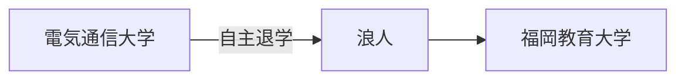

# 自己紹介
ソフトウェアエンジニアです
- 中規模トラフィック(1000万PV以上/月)のWebメディアにて開発しています
- システムの責任者なので技術選定やissueの優先度、対応方針の意思決定などします
- フロントエンド・バックエンド・データ基盤まわりがメインです
- ユーザーフレンドリー・表示スピード・SEOを意識したシステムアーキテクト・実装をします
- サーバーダウンなどの障害は迅速に確認と影響程度をビジネスサイドに共有後、改善用デプロイをおこないます
- 意思決定をサポートするビジネスサイドドリブンなデータ基盤を運用します

## 技術
- Ruby on Rails
- HTML, CSS, JavaScript
- MySQL
- AWS
  - Route53
  - ALB
  - WAF
  - OpenSearch
  - Opsworks
  - Redis/Memcached
  - EC2
  - RDS
  - CloudFront
- GCP
  - BigQuery
- BIツール
  - LookerStudio
- その他
  - rollbar
  - imgix

## 職務例

### Webアプリケーション
- ユーザー表示画面側の実装(社内要件定義 ~ 実装)
- Google Search Consoleからの課題発見&改善
- GoogleのSEOドキュメントキャッチアップ

### データ基盤
- Google Analytics 4 の導入 ~ LookerStudioを使用したBIレポート作成
- ビジネス要求から逆算したイベントデータ発火プログラム設置 & レポート
- コスト最適化したデータ分析設計

# 履歴書

## 学歴

## 職歴

## 資格・特技・スキル
- TOEIC 860
- TOEFL iBT 81
- 基本情報技術者

## Editor
- Visual Studio Code
- Vim

# プライベート

## 趣味
- マンションウオッチ
- 株
- ラブコメ漫画
- エレキギター
